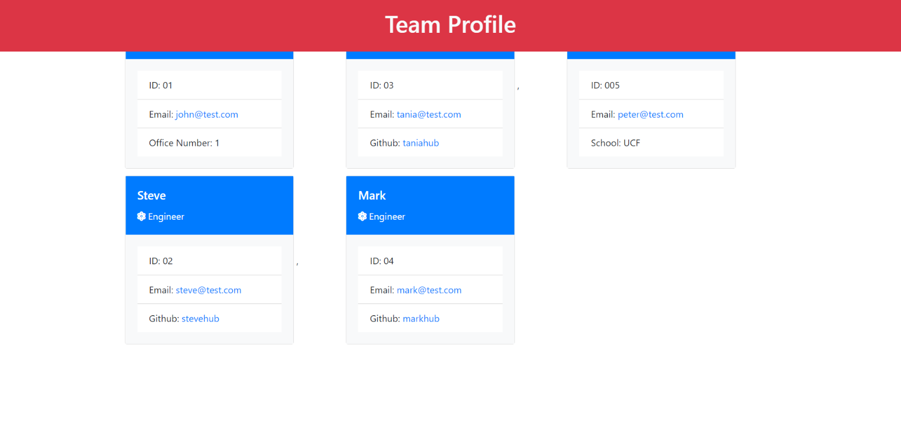

# team-profile-manager

# Description
A node.js application built with TDD practices.  This application collects user input from the command prompt to generate a visually appealing grid of employees with specified metadata.

# Installation 
  clone repository
  
## Badges

<a href="https://drive.google.com/file/d/1woIQP4uU8K902dIpbjLbETEIQNAVFg74/view">Link to demo video</a> 
<a href = "https://www.dropbox.com/s/0fope1mx71w9ic7/index.html?dl=0">Link to Generated Index File</a>
 
